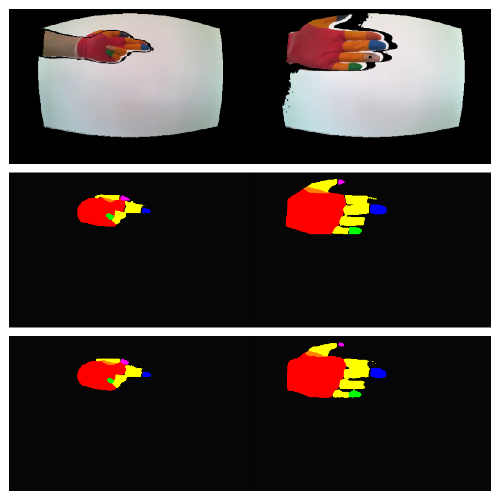
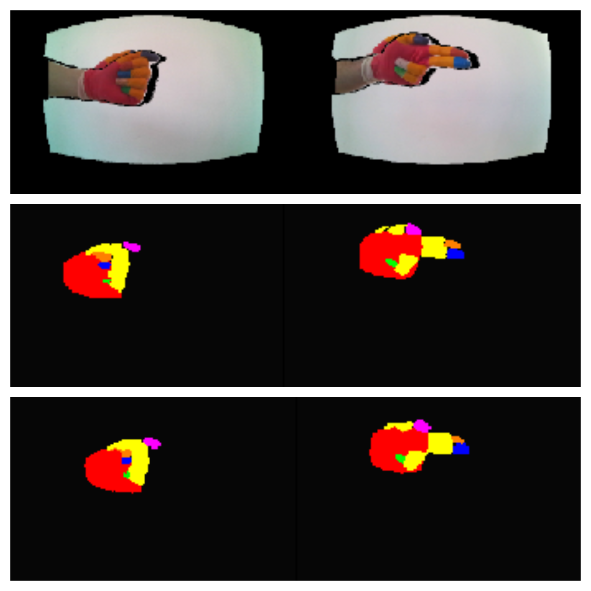

# Semantic segmentation on depth images with gesture classification

## Project description
Azure Kinect is used for capturing with both RGB and depth camera. User is wearing specially colored glove such that it's possible to _easily_ extract ground-truth semantic segmentation. DNN is trained to perform semantic segmentation on depth images. After DNN takes input data, simple classifier of hand gastures is trained on its' outputs.

## Pipeline
Data is collected using Azure Kinect with RGB and depth camera recording simultaneously. RGB image is then projected in depth POV using official SDK and automatically segmented using hand-crafted method based on HSV ranges. DNN for semantic segmentation is trained on depth images having previously segmented images as targets. Gesture classifier is trained on DNN's outputs of depth images with hand extracted using bounding box and downsampled.

There is total of 5 gestures that are taken from ASL. Gestures are recored in takes of 2-3 seconds length. Since gesture is actually happening in the middle of a take, first and last portion of take are rejected. Total of two users are used for data collection.

Every take of a single gesture belongs to either training or validation set but only one take per gesture is used for validation.

## Architectures
For semantic segmentation [DeepLab v3+](https://arxiv.org/abs/1706.05587) is used [implemented in PyTorch](https://github.com/jfzhang95/pytorch-deeplab-xception). For gesture classification, [LeNet](http://yann.lecun.com/exdb/lenet/) is used implemented in PyTorch as well.

## Training
Every take of a single gesture belongs to either training or validation set but only one take per gesture is used for validation.

There were total of ~2800 frames. Epoch for DeepLab takes about 30 minutes on GTX 1060 with 6GB of video memory. It was trained for 5 epochs. LeNet was trained until validation loss started increasing. Whole LeNet training takes about 5 minutes on Tesla k80.

## Results
* Mean intersection over union (mIOU): 0.859
* Class acuraccy: 93.5%
* Gesture classification: 97%

## Examples

## Futher work
* Collect more data in different environment
* Use more gestures with _unkown_ class
* Use optical flow to determine static portion of a take
* Increase variance in gestures
* Make pipeline real-time

## Notes
Model files that are provided are only that are different. Everything else is same as in original implementation. Pretrained models are not provided since they converge **extremely** fast. Dataset is not provided.

## Collaborators
* [Kosta Grujčić](https://github.com/4eyes4u/) _author_
* [Mihailo Grbić](https://github.com/MihailoGrbic) _author_
* [Aleksa Gordić](https://github.com/gordicaleksa) _mentor_
